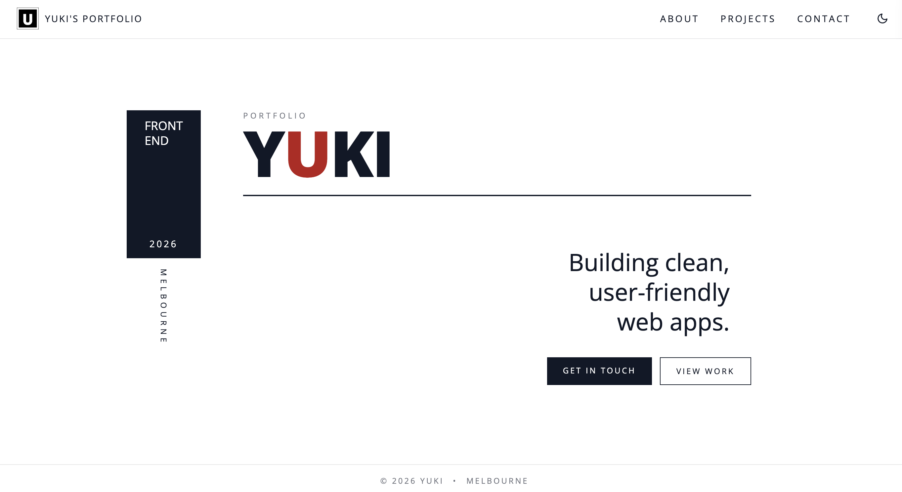

# Yuki Portfolio

A modern, minimal portfolio website built with React and Tailwind CSS.

## Screenshot

  

## Live Site
https://your-site-url.com

## Overview
This project is a personal portfolio designed to showcase my front-end development skills.

The focus of this project is:
- Clean and minimal design
- Clear structure and readability
- Smooth user experience
- Responsive layout

## Tech Stack
- React
- Vite
- Tailwind CSS

## Features
- One-page layout with scroll navigation
- Dark mode toggle
- Responsive design (mobile and desktop)
- Project showcase using reusable components
- Simple and accessible UI

## Structure
The project is built with a component-based structure:

- Layout – shared header and footer
- HomePage – main scroll container
- HeroPage – first impression section
- AboutPage – personal introduction
- ProjectPage – project list
- CardList / CardItem – reusable project components
- ContactPage – call-to-action section
- NotFound – 404 page

## Design Approach
This portfolio follows a minimal and editorial design style.

- Limited color palette (black, white, accent)
- Strong typography focus
- Reduced UI elements for clarity
- Subtle interactions instead of heavy animations

## What I Learned
- Building reusable React components
- Structuring a single-page application
- Using Tailwind CSS for consistent styling
- Designing with simplicity and intention
- Balancing UI and UX

## Contact
Email: yukicode26@gmail.com
GitHub: https://github.com/yukicode26